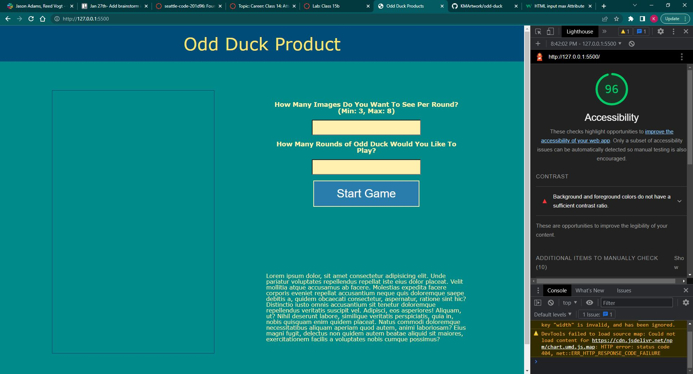

# Lab 11-12

Odd Duck Products project for Code Fellows, 201.

## Odd Duck Product

- Day 1 - Focusing on implementing constructors to create 'products' and the images displayed. Creating events & event handlers to track how many times an image was shown, how many times an image was clicked on, and then returning all the data as a list of results. Also give the user the ability to choose how many rounds they wish to play.
- Day 2 - Prevent same images from showing up in back-to-back rounds, Providing data visualization with chart.js, reformatting the webpage to fit a given wireframe.
- Day 3 - Implement local storage / persistent data so that number of views & number of clicks are still tracked after reloading a webpage. Only saves to local storage if/when a user clicks on "view results" at the end of a survey. Added option to retake the survey (local storage persists) or reset the data (local storage is cleared).

 ### Author: Kawika Miller

 ### Links and Resources

 Lab 12 Lighthouse Score:
 ;

 ### Reflections and Comments
